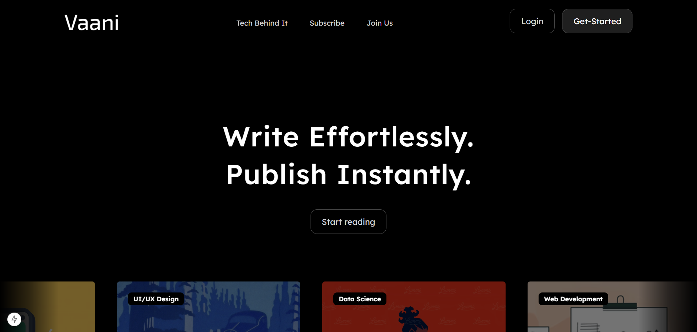

**Introduction**
---
Vaani is a blogging platform designed with a user-friendly experience.

**Features**
---
- Create, delete, edit, and manage your blogs effortlessly.
- Fast loading & mobile responsiveness
- SEO-friendly 
- User authentication (Sign up, Login)

**Teck Stack** :- 
---
- TypeScript - langauge
- NextJS - frontend
- Tailwind - CSS
- Zustand - state management
- Zod - validating and parsing data
- Hono - backend
- Vercel - frontend deployment
- Cloudflare - backend deployment
- Turborepo - monorepo

